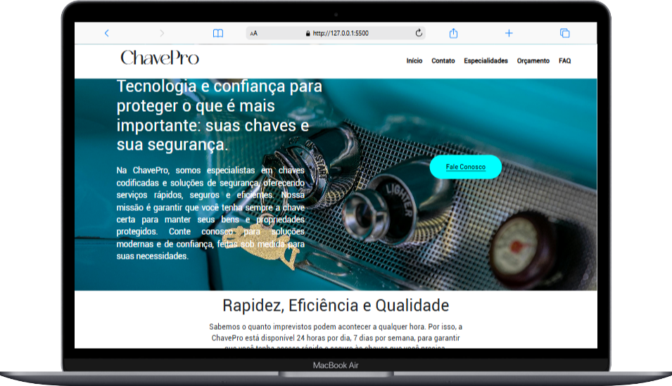

# Projeto final do curso de Desenvolvedor Front-End

O intuito deste repositório é expor o site feito no projeto final do curso de Desenvolvedor Front-End, no Senai. 

    
    

## Site proposto: Chaveiro

- [x]  Estrutura HTML
- [x] Organizando arquitetura de projetos font 
    - assetes
        - img
        - fonts
        - vídeos
- [x] Realizando primeiro commit
- [x] Estilo inicial CSS
    - CSS
        - header
        - main
        - footer
- [ ] Relalizando Responsividade        
- [ ] Realizando segundo commit
- [x] Enviando ao github

## Fontes Usadas
- catchye
- roboto

## Cores Usadas
- #ffffff
- #000000
- #00ffff

## Tecnologias Usadas
- HTML 5
- CSS 
- Javascript
- GitHub
